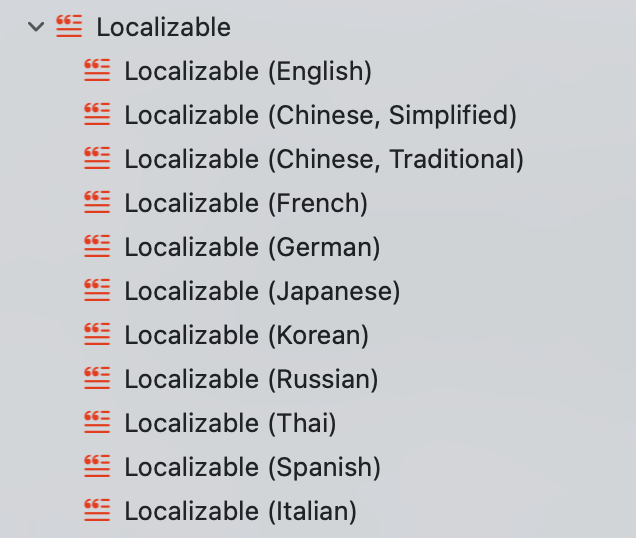

# 本地化最佳实践指南

在开发Xcode项目时，本地化是一项常见且重要的任务。采用一些好的习惯可以大大提高开发效率，并避免出现低级编码问题。本文将介绍一些在Xcode项目中进行本地化时的最佳实践。

## 0x01 本地化方法

在进行Xcode项目的本地化时，通常会使用 `NSLocalizedString` 系列方法，例如：

```Swift
NSLocalizedString("com.auu.localization.username", comment: "username")
```

为了简化书写，我们可以对其进行封装，例如：

```Swift
/// 本地化指定的键，并将占位符替换为提供的值。
///
/// - 参数:
///   - key: 用于查找本地化字符串的键。
///   - replaced: 一个可选的字典，包含占位符的键及其对应的替换值。默认为 nil。
///   - comment: 一个可选的注释，为本地化字符串提供上下文。默认为空字符串。
/// - 返回: 替换占位符后的本地化字符串，如果没有替换值，则返回原本地化字符串。
///
/// 此函数根据提供的键检索本地化字符串，并使用 `replaced` 字典中指定的值替换字符串中的占位符。占位符的格式为 `${key}`。
///
/// 示例:
///
///   ```swift
///   LL("event_schedule",
///      replaced: [
///           "eventName": "Annual Gala",
///           "date": "December 12, 2024",
///           "location": "Grand Hall"
///      ],
///      comment: "Event schedule announcement"
///   )
///   ```
///
/// 英文结果："The Annual Gala will take place on December 12, 2024 at Grand Hall."
/// 中文结果："2024年12月12日 年度晚会 将在 大礼堂 举行。"
///
/// 本地化字符串示例
/// 英文 Localizable.strings
/// "event_schedule" = "The ${eventName} will take place on ${date} at ${location}.";
///
/// 中文 Localizable.strings
/// "event_schedule" = "${date} ${eventName} 将在 ${location} 举行。";
///
func LL(_ key: String, replaced: [String: Any]? = nil, comment: String = "") -> String {
    /// 将任意类型的值转换为字符串。
    ///
    /// - 参数 value: 要转换的值。
    /// - 返回: 值的字符串表示。
    func stringify(_ value: Any) -> String {
        if let value = value as? String {
            return value
        }
        
        if let value = value as? CustomStringConvertible {
            return value.description
        }
        
        return String(describing: value)
    }
    
    // 如果有占位符需要替换。
    if let replaced, replaced.count > 0 {
        // 获取指定键的本地化字符串。
        var text = NSLocalizedString(key, comment: comment)
        
        // 用对应的值替换占位符。
        for (key, value) in replaced {
            text = text.replacingOccurrences(of: "${\(key)}", with: stringify(value))
        }
        
        return text
    }
    
    // 如果没有占位符需要替换，则返回本地化字符串。
    return NSLocalizedString(key, comment: comment)
}
```

## 0x02 多语言字符串Key的定义



### 1. 字面量Key

在定义多语言字符串的key时，可以选择使用字面量定义，例如：

```
"你好" = "你好";
"你好" = "Hello";
```

这样的好处在于看见key就能明白它是什么意思做什么用，但缺点也很明显：

1. 字面量内容过长时，在代码中编写会显得很冗余。
2. 当key对应的值做调整后，字面量key会跟实际内容不符，容易产生误导。

### 2. 通用字符串Key

我们可以将字面量换成一个通用字符串，然后添加统一的规则，例如：

```
"com.auu.localization.greet" = "你好";
"com.auu.localization.greet" = "Hello";
```

这样，无论对应的内容如何变化，都不会影响我们的使用。

## 0x03 内容录入与管理

为了支持多种语言，我们需要在每种语言下都添加对应的本地化内容。例如：

```
"com.auu.localization.greet" = "xxxx";
```

如果支持的语言很多，来回切换文件会很麻烦，而且需要保证所有语言下的key一致，并且都必须有内容存在。如果缺失或者写错，那么在对应的语言环境下使用时会出问题。

在使用时，例如 `LL("com.auu.localization.greet")`，需要我们准确地写出对应的key。但是，编译器不会检查字符串key的内容是否正确，如果我们在很多地方都需要用到这个key，手工编写很容易出错。

## 0x04 使用常量

使用常量可以很好地避免这些问题。例如：

```
let lLocalizationLanguageNameKey = "com.auu.localization.language"
```

在使用时可以写成：

```
LL(lLocalizationLanguageNameKey)
```

这样只需要在一个地方统一写好字符串常量，使用时就会非常方便。

## 0x05 使用常量的优势

1. 避免拼写错误

直接使用字符串key时，拼写错误很难被发现，因为编译器不会检查字符串内容的正确性。使用常量可以避免这种错误，因为编译器会检查变量名是否正确。

2. 便于维护和修改

当一个字符串key需要修改时，如果直接使用字符串key，需要找到所有使用该key的地方并逐一修改。而使用常量，只需修改常量的值，所有引用该常量的地方都会自动更新，极大提高了维护效率。

3. 代码可读性更高

常量名通常比字符串key更具描述性，能够更直观地反映出该字符串的用途。例如，`lLocalizationLanguageNameKey` 比 `"com.auu.localization.language"` 更易于理解和记忆。

4. 集中管理

将所有本地化key集中定义在一个地方（如常量文件）便于管理。这种方式可以让开发人员更清晰地了解项目中有哪些本地化key，以及它们的用途。

5. 提高代码一致性

使用常量可以确保在不同文件和模块中使用相同的key时保持一致。即使有多个开发人员共同参与项目，使用常量可以确保大家都引用同一个key，而不会因为个人习惯或记忆错误而导致使用了不同的字符串key。

使用常量相较于直接使用字符串key的优势包括避免拼写错误、便于维护和修改、提高代码可读性、便于集中管理以及提高代码一致性。这些优势不仅提高了开发效率，还减少了因拼写错误导致的bug，增强了代码的可维护性和可读性。

通过将所有本地化字符串key定义为常量，开发人员可以更加专注于业务逻辑，而不必担心字符串key的拼写和一致性问题，这对于大型项目和团队协作尤为重要。